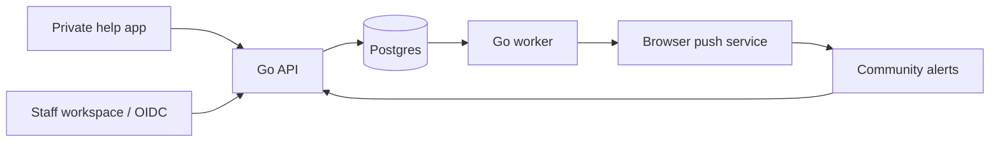

# Architecture
The current system is a modular Go API, a separate Go worker, two React/TypeScript apps and Postgres/PostGIS. Redis is optional; Flutter is deferred.

## Boundaries
- Public session credentials authorize private case access. Staff identity uses a separate audience and database organization/role mapping.
- Public alert data is a minimized projection, never the private case record.
- Alert activation commits its outbox event in the same database transaction.
- The worker creates deduplicated area-matched jobs, then rechecks approval, active revision, expiry, mode and revocation immediately before sending.
- Browser subscription endpoint and keys are private delivery credentials, not public identifiers.
- UI role restrictions are convenience; the API must enforce permissions.

## Delivery reliability
Jobs are claimed with row locks. Provider calls are bounded. Explicit transient provider responses can retry within the attempt budget; ambiguous network outcomes are not blindly replayed. Stale processing is marked ambiguous. Provider acceptance is not device display.

The current worker holds relevant locks across the bounded provider call to serialize against withdrawal. This favors clear cancellation semantics over throughput. Load testing and lock-duration monitoring are required before expanding volume.

## Deployment
Serve both frontends over HTTPS, supply exact API origins, run migrations as a controlled release step, then API and worker. Use separate runtime database roles and managed secrets before a pilot. Local Compose combines migration/startup for convenience; that is not the final production rollout model.
