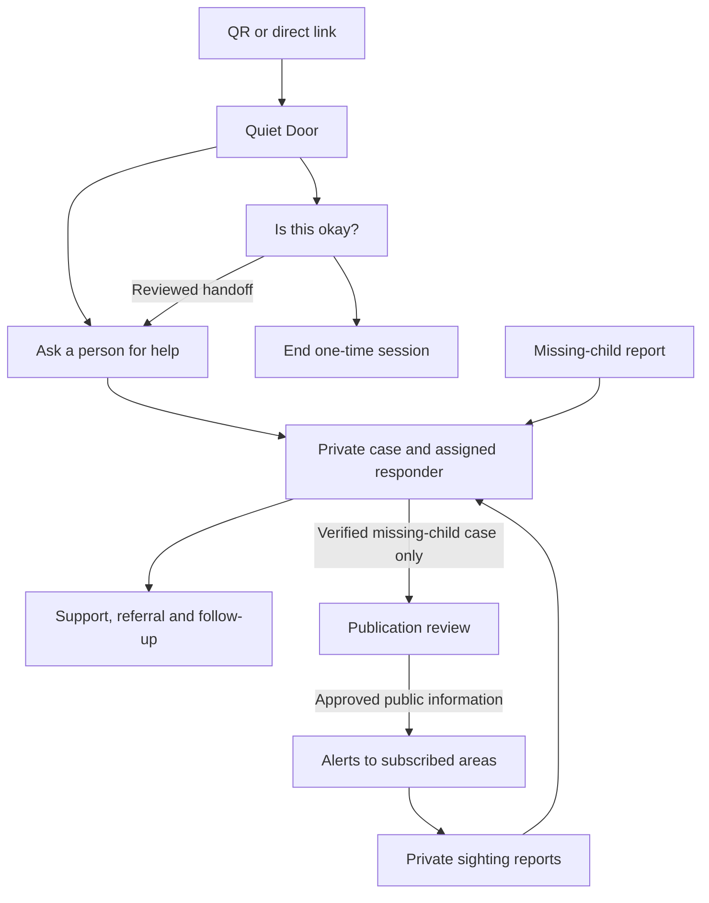

# Bal Suraksha: product and system blueprint

Prepared 11 September 2026. This is a proposed product design, not an implemented or operating emergency service. Product names are working names. Technical choices and pilot targets below are recommendations; external service access, legal applicability and operational commitments require confirmation before deployment.

## 1. The product in one sentence

A child can privately understand a concern, reach an accountable human responder, and—when a verified missing-child case warrants public help—reach people following the relevant area through a controlled alert network.

The product has three connected layers:

- **Ask:** Quiet Door provides QR access, “Is this okay?” and a one-time session option.
- **Act:** trained responders receive reports, accept responsibility, communicate privately and follow through.
- **Alert:** designated publishers issue verified geographic notices and receive private sightings.

Incognito is an access and privacy mode across the first layer. It is not a separate service or a claim that submitted records disappear. Digital Fire Drill is excluded as a consumer feature. Internal operational drills remain necessary to test notifications and responders.

The central product principle is controlled movement of information: a child’s initial question, a confidential support case and a public alert have different audiences and purposes.

## 2. Who uses it and what each person can see

| Person | Main task | Access boundary |
| --- | --- | --- |
| Child or concerned friend | Ask a question, request help, return privately | Their own session or case through its private access mechanism |
| Parent or other reporting adult | Submit a concern or missing-child report | Their submitted information and permitted updates; no automatic access to a child’s separate disclosure |
| School or venue administrator | Maintain QR placement and support arrangements | Placement status and sufficiently aggregated service measures; placement ownership does not grant case access |
| Trained responder | Triage, communicate, make referrals and follow up | Explicitly assigned cases and permitted information |
| Safeguarding supervisor | Handle urgent escalation, conflicts and case transfers | Controlled oversight within their authorized service |
| Alert preparer and approver | Verify a case and approve public content | Necessary verification material, with a separate publication permission |
| Adult community subscriber | Receive alerts for chosen areas; provide observations | Approved public notice and their own submitted tip receipt |
| Platform operator | Maintain the service | Operational metadata by default; exceptional content access requires a recorded reason and review |

Start the direct child-facing pilot with an age-appropriate teen journey, for example ages 13–17, and support adult reports about younger children. This is a usability scope, not a legal age-of-consent exemption. Extend younger-child journeys with specialist and child participation.

## 3. Quiet Door: the entry experience

Each QR opens a first-party HTTPS address with an opaque placement identifier. It resolves to a verified venue, language options, support hours and available response routes. Print the recognizable domain beside the QR. Support placement revocation and replacement so a compromised or outdated poster can be disabled.

The first screen offers:

1. “Is this okay?”
2. “I need help.”
3. “I’m worried about someone.”
4. “A child is missing / I may have seen them.”

Urgent assistance information must be visible without completing the flow. Offer clearly labeled access to 112 and Child Helpline 1098; a dial action is not proof a call connected. India’s official March 2026 description confirms 1098’s integration with ERSS-112. [MHA parliamentary answer](https://www.mha.gov.in/MHA1/Par2017/pdfs/par2026-pdfs/LS24032026/5252.pdf)

Before collecting a detailed account, explain the service, intended recipients, service hours and relevant confidentiality limits in short, age-appropriate language. Let the child indicate “It may not be safe to contact home” or “Someone at this school is involved.” Route such concerns to an independent authorized responder. Never make the implicated institution the sole path to help.

Essential interface behavior:

- No compulsory account, phone number or app installation merely to reach general guidance.
- Collect personal information only under the approved processing pathway.
- Text first; voice and accessible alternatives as validated capabilities.
- Let users skip nonessential questions and correct summaries.
- Show unsent, submitting and received states accurately; never imply that a network-failed report reached a responder.
- Provide a quick-exit action that clears active app state and navigates away. Explain that browser history, downloads and device monitoring can remain.
- Do not put private conversations into browser notifications by default.
- Do not cache private reports or attachments in the PWA service worker.

## 4. Incognito: define the promise precisely

Use **“Incognito — one-time session”**, with a short explanation. Incognito alone does not establish whether a record is retained, whether the network sees a visit or whether a person can return.

Provide two outcomes:

**Check and leave.** No account is created and no continuing conversation appears in the product after the session ends. Minimize collected content, avoid unnecessary durable copies and use the approved retention schedule. Do not market this as “nothing is stored anywhere.” Determine whether local processing is suitable for a future stronger privacy option.

**Send for help.** Preview the report, recipient and applicable confidentiality/retention terms, then create a support case. The person can keep a private return code or leave without keeping access. Leaving ends their session; it does not delete a submitted case or cancel duties arising from it.

A retained case needs a secure continuing conversation. Use a long, cryptographically random return secret, preferably displayed as manageable word groups; store only its secure verifier. Keep secrets out of URLs, analytics and logs. Rate-limit attempts and allow safe revocation. Explain that without a recovery method, a lost code cannot simply be retrieved using the child’s name. Optional verified recovery must not expose a child through an unsafe contact.

Explicit exit and inactivity invalidate the active session credential and clear local private state. Private responses use `Cache-Control: no-store`; returning to a private route requires valid authorization. A separately issued return code remains usable only when continuing access was deliberately chosen. Test browser-back and shared-device behavior; the application cannot guarantee erasure of browser or device traces.

Maintain separate policies for session state, input content, AI processors, case records, attachments, access logs, backups and legally preserved records. Application history removal is different from backend deletion. No advertising, session replay, behavioral profiling or joining an incognito session to the community subscriber’s identity.

## 5. “Is this okay?”: bounded AI assistance

Its purpose is to help someone understand concerning behavior and choose a next step. It does not determine guilt, certify that a person is safe or act as a substitute responder.

Begin with voluntary selected text in English and Hindi/Hinglish. Add other languages after evaluation with fluent reviewers. Later, offer screenshot cropping and previewed OCR so users can remove unnecessary names or content. Do not require screenshots or intimate material to get help.

The response should contain:

- A brief acknowledgement without blame.
- Specific behavior visible in the submitted account.
- A clear uncertainty statement where context is incomplete.
- At most a small number of necessary, non-leading clarifying questions.
- Practical options drawn from reviewed safeguarding guidance.
- A direct human-help option that does not depend on the AI’s risk assessment.

For the backend, use structured outputs such as observed behaviors, supporting message references, uncertainty and suggested options. Keep AI-generated urgency separate from human-assigned urgency. Preserve user corrections and distinguish model suggestions from facts.

Use approved guidance as the response source, a versioned model/prompt configuration, strict input/output handling and provider terms covering retention, training, region and subcontractors. Treat uploaded text as untrusted data: instructions inside it must not control the application or its tools. AI gets no permission to publish alerts, reveal other cases, contact parents or dispatch responders.

The evaluation set should include benign teasing, escalating coercion, ambiguous context, code switching, spelling variation, disability-related language, sensitive identity references, false accusations and adversarial instructions. Track missed concerns, false alarms, harmful guidance and translation failures separately. Have safeguarding specialists adjudicate difficult cases.

If AI is unavailable or unsupported in a language, retain the reporting and human response path. Rollback and a feature kill switch are launch requirements. UNICEF’s current guidance emphasizes safety, privacy, fairness, transparency and accountability for children’s AI systems. [UNICEF guidance, version 3](https://www.unicef.org/innocenti/reports/policy-guidance-ai-children)

## 6. Private support and accountable follow-through

A case records the person’s account, optional contact details, safe-contact preferences, case owner, priority, messages, referrals and restricted attachments. Case identity and contact information should be separately permissioned from the narrative.

Suggested lifecycle:

`Received → Awaiting triage → Assigned → Accepted → Support underway → Follow-up → Closed`

Allow a case to be reopened. Track waiting-on-user and waiting-on-partner as explicit conditions. “Received by the server,” “accepted by a responder” and “help occurred” are separate events.

Every active case needs an accountable owner, next action and review time. Escalation timers operate even when AI is unavailable. A referral is complete only when the receiving organization acknowledges it; an unanswered email or exported document is not a completed handoff.

The child sees safe, understandable progress information. Professional notes, other reporters’ identities and investigation details stay restricted. Closure requires a recorded reason and an offer of further help; feedback from the child is useful without making a response a condition for necessary protective action.

The responder console needs a queue, assignment, secure conversation, safe-contact warnings, conflict flags, handover, missed-response escalation and a history of who accessed the case. Case routing considers jurisdiction, role, language, service hours, capacity and conflict of interest. Administrators cannot use report volume to punish a school or reporter.

## 7. The India local alert network

AMBER began after nine-year-old Amber Hagerman was abducted and killed in Texas in 1996. The design lesson is rapid coordination among responsible authorities, communication channels and the public. Use that factual origin without graphic storytelling or claiming a proposed product would have prevented a specific death. [US DOJ history](https://amberalert.ojp.gov/about)

US AMBER activation follows defined criteria involving suspected abduction, serious danger and actionable information. These are a reference model, not Indian legal criteria. [DOJ activation guidance](https://amberalert.ojp.gov/about/guidelines-for-issuing-alerts)

Call the initial module **Verified Local Alerts**, or another clearly independent working name. Establish India-specific publication criteria with designated partners. All missing-child reports get urgent private routing; public-alert eligibility must not delay seeking official help or require a person to arrive with an official case number.

Publication workflow:

1. Receive a private report with last-seen time/place, description, suitable photo, circumstances, safe callback information and any existing official reference.
2. Assign an on-duty responder and record official escalation.
3. Verify the incident and claimant through designated professional or police contacts. A family upload or AI classification is insufficient authorization.
4. Assess whether publicity could expose a child escaping abuse, worsen a custody dispute or otherwise harm them.
5. Prepare approved public fields, languages, coverage region, expiry and tip destination.
6. Obtain a separate publication approval, preferably with two authorized staff. Any expedited procedure must be pre-agreed and audited.
7. Notify eligible subscribers and open a restricted sighting queue.
8. Review tips privately; responsible authorities determine investigation and protective next steps.
9. Issue corrections, expand or narrow coverage when authorized, withdraw false notices, or mark the alert resolved.
10. Remove identifying public content according to policy while preserving necessary restricted records. Finding a child does not automatically authorize handing them to the original claimant.

Public alert information should be a separately approved publication object: alert ID, issuer, verification time, minimum necessary description/photo, last-seen area/time, expiry, live status and tip route. Do not expose the private case, precise live sightings, family phone numbers, sensitive abuse history or reporter identity. Avoid public comments, crowd pursuit tools, suspect scoring and public facial recognition.

Every public card links to its current status. After resolution, preserve a minimal status notice without unnecessary identifying detail. Updates and withdrawals cannot erase screenshots or notices already displayed on someone’s device; minimize exported posters and make timestamps visible.

India’s TrackChild and Khoya-Paya are now integrated into the unified Mission Vatsalya Portal, according to the March 2026 MHA answer. The old TrackChild site also announces migration. Plan around the current system. [MHA answer](https://www.mha.gov.in/MHA1/Par2017/pdfs/par2026-pdfs/LS24032026/5252.pdf), [TrackChild migration notice](https://trackthemissingchild.gov.in/)

## 8. How registered-area notifications work

Adult subscribers choose places they follow: a locality, ward or district, with language and channel preferences. This is not proof they currently occupy that area. Continuous GPS is unnecessary for the initial product. Store these subscriptions separately from child support sessions.

The authorized publisher selects a reviewed coverage polygon. Match it against subscription areas, deduplicate overlapping subscriptions and generate recipient jobs. Add expiry/review reminders for subscribers’ choices. Source administrative geometry from a licensed, maintained dataset and version it; a postal code is not automatically a precise official polygon.

A future “near me” mode would require separate location consent, limited precision, an expiry for stale locations and an explicit explanation of its coverage. Do not silently turn area subscriptions into background tracking.

Use web push and native push where permitted, with SMS only through a properly configured provider and explicit channel consent. A QR visit alone does not enroll a phone. On iOS, web push requires a Home Screen web app and permission. [Apple web push documentation](https://developer.apple.com/documentation/usernotifications/sending-web-push-notifications-in-web-apps-and-browsers)

Distinguish eligible, queued, provider-accepted, observably delivered and opened counts. Delivery is best effort. Set message TTL to the remaining alert lifetime; a stale notice should not appear days after a case closes. [FCM message lifespan](https://firebase.google.com/docs/cloud-messaging/customize-messages/setting-message-lifespan)

Government cell broadcast is a different channel. India’s CBS/SACHET launch describes authority-issued geographic warnings; it does not grant this product access or establish missing-child alert eligibility. The beta reaches consenting subscribers, not every phone in an area. [Official CBS launch](https://www.pib.gov.in/PressReleasePage.aspx?PRID=2257499&lang=1&reg=3)

## 9. Technical architecture

Use a **Go modular monolith with separate background workers**, a React/TypeScript web application and a React/TypeScript operations console. This provides clear ownership and transactions with manageable operational complexity. Split services later when measured scale or a security isolation requirement justifies it.

| Component | Recommendation | Purpose |
| --- | --- | --- |
| Public and private web experiences | React + TypeScript, responsive PWA | QR entry, private help, area enrollment and alert viewing |
| Operations console | React + TypeScript with separate authentication boundary | Responder work, approval, organization management and audits |
| Application backend | Go, explicit modules and versioned REST APIs | Enforce workflow, access and retention rules |
| Persistent data | PostgreSQL + PostGIS | Transactions, cases, geographic audiences and delivery state |
| Attachments | Encrypted private object storage | Controlled evidence access and approved public derivatives |
| Durable work | Database outbox and worker processes initially | Reliable notifications, escalation and cleanup |
| Temporary coordination | Optional Redis | Rate limits and temporary state; never the only copy of a received case |
| Identity | Maintained OIDC-based staff identity with MFA; separate case return secrets | Secure staff sessions and low-friction private access |
| AI/OCR/translation | Provider adapters with independently switchable features | Bound processing and avoid dependency on one vendor |
| Mobile later | Flutter + generated Dart API client | Native notification enrollment, supported sharing and field workflows |
| Deployment | Containerized services and managed database in an approved region | Repeatable delivery, recovery and vendor governance |

Generate TypeScript and Dart clients from one OpenAPI contract. Keep permissions and workflow decisions in the Go backend. Do not duplicate business rules across React and Flutter. Native functionality means genuine first-party workflows backed by operating services; OS push, messaging and approved AI still depend on external providers.

Use TLS, managed keys/secrets, separate test/staging/production environments and controlled deployment migrations. Add infrastructure as code, health checks, dashboards and on-call alerts. Sensitive data should be encrypted at rest and in transit; do not advertise end-to-end encryption while the server or AI provider can read it.

Minimum backend modules: entry points; sessions; assessments; case management; secure messaging; responder directory; routing and referrals; alert verification; area subscriptions; delivery; sightings; access audit; retention and legal holds.

Core records: `Organization`, `Venue`, `EntryPoint`, `StaffMembership`, `RoleGrant`, `PrivateSession`, `Case`, `CaseMessage`, `CaseAccessGrant`, `Attachment`, `Assignment`, `Referral`, `ContactPreference`, `NoticeAcceptance`, `RetentionRule`, `LegalHold`, `Alert`, `AlertRevision`, `AlertApproval`, `Area`, `AreaSubscription`, `DeliveryJob`, `DeliveryAttempt`, `Tip`, `AuditEvent`.

Not every session record should contain stored content. Retention is a policy decision per data class. A public alert links internally to its case but serves only approved publication fields through a dedicated public API.

Illustrative API groups: `/entry-points`, `/sessions`, `/assessments`, `/cases`, `/case-access`, `/messages`, `/assignments`, `/referrals`, `/alert-drafts`, `/alert-approvals`, `/public/alerts`, `/subscriptions`, `/tips` and restricted audit endpoints. Authorization applies to every object, attachment and export, not just the screen displaying it.

PostGIS provides indexed geographic matching; geography-based distance checks use metres. Use tested geographic queries and boundary cases. [PostGIS ST_DWithin](https://postgis.net/docs/ST_DWithin.html)

## 10. Reliable publication and data boundaries

Alert state: `Draft → Under review → Approved → Active → Resolved / Withdrawn / Expired`. Changed public content creates a new revision and the required approval. Authorization to cancel a harmful alert should be fast and explicitly assigned.

Approval binds the complete revision: text, photograph, geographic audience, issuer, expiry and tip destination. Publication verifies that the exact approved revision is being activated. Changes to any of these fields trigger the applicable approval again; editing the destination or coverage cannot bypass review.

In one database transaction, save the approved active revision and an outbox event. A worker expands its audience and creates delivery jobs. Unique keys prevent duplicate logical deliveries across retries and multiple subscriptions for the same recipient/channel. Failed jobs have bounded retries, backoff and operator visibility.

Before every send, recheck permission, alert status, revision and expiry. Workers must recover safely after crashes. On withdrawal, stop unsent jobs and send an appropriate correction to the previously targeted audience where permission remains. Clients open the current authoritative status and reject expired or obsolete revisions where platform control permits. No implementation can guarantee recall of already displayed OS notifications.

For received reports, acknowledge only after durable database commit. Use idempotency keys so repeated submission after a connection failure does not create multiple cases. Prevent concurrent assignment or closure races through transactional updates and version checks.

Enforce four distinct data boundaries:

1. Session content and any continuing private report.
2. Assigned professional case access and optional identity/contact records.
3. Explicitly approved public alert fields.
4. Restricted sightings and community delivery/subscription data.

A role in one boundary does not imply access to another. A school administrator does not inherit every case from its QR; a reporter does not inherit precise sightings; a subscriber does not become a verified responder.

## 11. Safeguarding, privacy and security requirements

Before collecting real child disclosures, obtain an India-specific assessment of the operating entity, partner responsibilities, child-data processing basis, disclosure duties, public identification and retention. An accountless report can still contain identifiable child data.

The DPDP regime has phased commencement. Core duties and relevant Rules are scheduled for May 2027 rather than all being operative on this document’s date. The final Rules include child-consent provisions and retention requirements, including Rule 8(3), whose applicability must be resolved before promising server-side deletion. Design the beta to accommodate the upcoming regime. [Official commencement notification](https://www.meity.gov.in/static/uploads/2025/11/c56ceae6c383460ca69577428d36828b.pdf), [Official DPDP Rules](https://www.meity.gov.in/static/uploads/2025/11/53450e6e5dc0bfa85ebd78686cadad39.pdf)

POCSO section 19 provides for reporting to the Special Juvenile Police Unit or local police; an internal school/NGO ticket alone does not fulfill that destination. Section 23 restricts identity disclosure in covered media reports. A missing-child notice involving abuse therefore needs case-specific publication review. [Official POCSO Act](https://www.indiacode.nic.in/bitstream/123456789/2079/1/AA2012-32.pdf)

These obligations mean a disclosure cannot be promised unconditional secrecy. Safeguarding disclosures and parent-contact decisions need a trained, legally reviewed process. Do not automatically notify a potentially unsafe caregiver. Confirm lawful routes for children who cannot safely involve a parent; do not assume an NGO partnership grants a blanket exemption. Review Juvenile Justice identity protections and other applicable restrictions as part of publication authorization too.

CERT-In directions cover security-log retention and specified incident reporting for covered entities. Separate security logs from narrative content, control their access and define the incident process. [CERT-In directions and FAQs](https://cert-in.org.in/Directions70B.jsp)

Required controls include staff MFA; organization and case-level access tests; short-lived signed attachment access; malware handling; restricted exports; key rotation; rate limiting; abuse review; secure recovery; privacy-safe monitoring; dependency patching; and a vulnerability reporting process. Treat inaccurate or ambiguous reports fairly; AI uncertainty is not evidence of malicious reporting.

Periodically reverify partner authority and staff access. When a role ends, revoke credentials and active sessions, remove publication rights and reassign open cases. Partner offboarding must preserve accountable case ownership and lawful records without leaving old staff access active.

Do not solicit intimate child imagery. Define a specialist handling/reporting process for unsolicited illegal material before enabling uploads. Do not send such material to a general OCR/AI service or expose it to all support staff. Keep authorized originals restricted and separate from redacted working copies and public derivatives.

Maintain a retention register with purpose, legal basis, access roles, period, processor copies, backup behavior, deletion method and legal-hold exception. Test that restoring backups does not resurrect records due for deletion. Publish child-readable information and a contact for privacy questions and complaints.

Target WCAG 2.2 AA with actual keyboard, screen-reader, text-size, contrast and cognitive-usability testing; automated checks alone are insufficient. Test low-bandwidth Android devices, shared devices and language readability. [W3C WCAG 2.2](https://www.w3.org/TR/WCAG22/)

## 12. Additional features worth building

**Safe contact preferences:** permitted hours, channels and whether device notifications are safe. Helps the service respond without exposing the report.

**Independent escalation:** a visible alternative when the school, caregiver or assigned responder is implicated. This is a core support capability.

**Service availability:** verified working hours, capacity, fallback and a directory review date. Never show a responder as available solely because their account exists.

**Preview before sharing:** the child or authorized professional sees the exact report, referral or public notice and its recipients. Required reporting follows the disclosed legal process rather than a false promise of absolute veto.

**Child-readable progress:** plain updates, an “I still need help” action and a way to challenge closure without repeating the whole account.

**Verified alert status:** issuer, issue time, expiry, corrections and a stable current-status link. Makes stale forwards easier to identify.

**Organization accountability:** response delay, unaccepted referrals and follow-up completion measured in aggregates that suppress small groups. Avoid exposing children through small-cohort analytics.

**Operational switches:** temporarily disable AI, a compromised QR, public publication or a faulty notification provider independently while preserving safe alternatives.

## 13. Build and launch sequence

| Stage | Working deliverable | Condition for advancing |
| --- | --- | --- |
| Product validation | Teen/responder co-design, threat model, operating partner and legal pathway | Named service owner, documented intake and escalation duties, understandable privacy promise |
| Hackathon implementation | QR → one-time check → deliberate report → responder reply → return access; separate fictional alert → area push → tip → withdrawal | End-to-end demonstration uses clearly labeled synthetic cases and test subscribers |
| Closed support beta | Real permissions, records, monitoring, limited languages and staffed support in one locality | Safeguarding readiness, security review, tested restoration, correct notices and access boundaries |
| Controlled alert pilot | Approved publisher workflow and opted-in adults in a defined area | Designated professional/police liaison, publication criteria, coverage, operating rota and correction drills |
| Broader production | Multi-organization access, measured delivery reliability, additional languages and optional Flutter | Evidence from beta, sustainable staffing and funding, operational and independent security sign-off |

Build the alert functionality fully in test mode while agreements are pending. Do not present simulated police/API integration as live. For Mission Vatsalya, 1098, 112 and official broadcasting, start with documented human handoff and an external reference record. Implement automated adapters only after access and terms are granted.

Keep child access free. A potential funding model is institutional contracts and grants for responder operations and software. Funding must not grant unrestricted access to disclosures, create advertisements based on children’s concerns, or make institutions able to suppress independent escalation.

Staffing functions required: product/UX and accessibility; Go backend; React frontend; QA and security/operations; a safeguarding lead; trained responders; privacy/legal advice; and a publisher/police liaison. Some engineering functions can be combined in a small team. Staffing an emergency response rota cannot be replaced by an app or an AI model.

Budget separately for engineering, responder coverage, managed hosting/backups, messaging volume, AI/OCR usage, translation review, audits, incident response and support. Do not assume all cost is infrastructure. Estimate delivery cost from recipients × channels × approved alert/update volume, with actual provider quotes.

## 14. Acceptance tests and operating measures

Release checks should cover:

1. Repeated submission after a timeout creates one durable report.
2. An unavailable responder results in a visible fallback and timed escalation.
3. A school cannot view a case simply because its QR was used.
4. An implicated caregiver or school is not contacted by an automatic default.
5. Another person cannot guess a private return secret or read an attachment.
6. Ending a one-time session removes app access and follows the stated data policy without false deletion claims.
7. AI failure, unsafe output or unsupported language never blocks access to human help.
8. Anonymous input or an AI score cannot publish a missing-child alert.
9. Approval changes and public content edits have a traceable revision history.
10. Overlapping areas and queue retries do not create duplicate logical deliveries.
11. Expired or withdrawn alerts stop generating fresh jobs; stale platform-delivered notices lead to current status.
12. Exact sightings and reporter identities stay out of public pages and claimant access.
13. Test alerts cannot reach the production recipient list.
14. Backup restoration, deletion and legal holds interact as documented.
15. Keyboard, screen reader, shared-device and low-bandwidth journeys work on actual target devices.

Measure time to durable receipt, time to human acceptance, unaccepted-case age, missed escalations, acknowledged referrals, unresolved follow-ups and voluntary child feedback. For alerts measure approval-to-queue time, delivery failures, expiry behavior and actionable tips reviewed. Distinguish provider acceptance from actual delivery. Avoid using app engagement, number of reports or claimed “children saved” as unqualified success measures.

As provisional internal engineering objectives, consider 99.9% intake availability, a two-second p95 non-AI receipt target under an agreed load, and notification-job creation within one minute of approval. These are proposed service targets to validate and fund, not measured capability or promises of human response. Human response targets must be agreed with the staffed partner. Include a documented emergency fallback whenever the service is unavailable.

Before implementation, select the pilot locality, initial language set, accountable response partner, publisher authorization process, age-appropriate entry journey, retention policy and real versus simulated integrations. The first useful production slice is a reliable report-to-response loop, with the alert network enabled only for its agreed operating scope.
